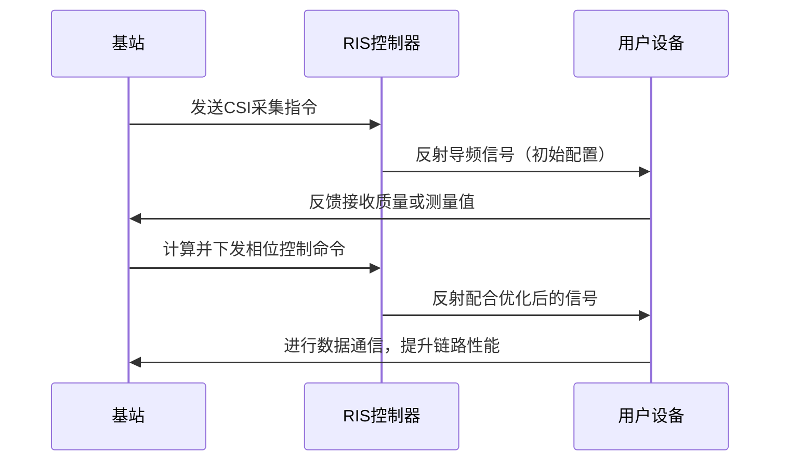

# 执行摘要

可重构智能超表面（Reconfigurable Intelligent Surface，RIS）是一种新兴的电磁控制技术，可以通过编程控制环境对电磁波的反射相位，实现对无线信道的可控增强。与传统不可控传播环境不同，RIS由大量可调节单元组成，通过施加控制信号动态改变这些单元的电磁特性，从而以可编程方式对空间电磁场的幅度、相位、极化等进行智能调控。在高频移动通信中，建筑物、车辆车厢、玻璃等障碍物对信号产生严重的穿透损耗（可达数十 dB 级），而RIS可在路径旁侧部署或集成在障碍物上，通过相位对齐的反射增强信号，从而部分抵消穿透损耗带来的衰落。与纯被动反射相比，RIS因具有**低功耗**、**易部署**和**成本低**等优点，在近距离覆盖增强、非视距补偿、毫米波传输等场景具有潜力。但被动RIS受“乘法衰落”效应制约，需要大量单元才能形成显著增益。为此，研究提出了**有源RIS**（在每单元集成放大器补偿路径损耗）和**半被动RIS**（部分单元具备信号接收能力以辅助信道估计）等变体，兼顾性能与能耗。报告全面介绍了RIS在移动通信环境下的关键物理原理（电磁波传播与相位控制）、穿透损耗成因及建模、RIS单元设计与不同实现方案、实时控制与信道估计策略，以及系统级的能耗、延迟、复杂度等设计权衡。结合仿真和实验结果，本报告阐释了RIS改进信道增益的数学模型和典型曲线，列举了产业界进展与示范案例，总结了当前局限与工程挑战，并给出短中长期的工程与研究建议。报告语言通俗易懂，适合具备高中物理知识的读者全面了解RIS技术的物理约束、设计演进及应用前景。

## 一、场景与用例

RIS可部署于室内外各种场景，以增强基站覆盖或用户接收。典型用例包括：  
- **高频基站覆盖增强**：在城市环境中，建筑物、树木等对毫米波信号有严重阻挡，通过在建筑立面、广告牌或灯杆上安装RIS，将信号反射至阴影区以提升链路质量。例如，韩国KT团队在MWC2023展会上演示了RIS可将毫米波信号从水泥墙传播至会议室等隔间，实现室内盲区覆盖。  
- **室内覆盖与盲区填补**：在大型厂房、购物中心等复杂室内环境，传统基站或小基站难全面覆盖，通过在墙面或天花板部署RIS，可定向反射基站信号，显著提高室内信号强度。实验表明，在5G校园场景中，安装RIS后弱覆盖区域的接收功率增益可达4～6 dB。  
- **移动体通信（列车、车辆）**：高铁、地铁等密闭车厢对信号有高衰减，RIS可沿车窗布置透明形态的超表面，反射车外基站信号进入车内；或在轨道沿线部署RIS，增强入射到车窗的信号能量，并可调控极化方向以降低大入射角时的玻璃穿透损耗。ZTE等研究指出，在不改变车厢结构的前提下，在列车每扇窗户贴附RIS，可有效增强车内覆盖。  
- **户侧与基站侧部署**：用户侧RIS可粘贴在窗户或墙面上，改善室内信号；基站侧RIS可部署在基站天线附近或环境中，高速行驶的终端（行人、车辆或列车）经过时RIS快速调整相位以跟踪其信道。RIS还可集成于智能硬件（如RIS玻璃、RIS透射元件），成为建筑与设备自带的无线环境控制模块。  

上述场景中，移动终端的速度范围涵盖行人级（~1–5 km/h）、车辆级（~30–120 km/h）及高铁级（~300 km/h）等。不同速度对应的信道时变性不同，RIS配置需考虑多普勒效应和快速波束跟踪。总体而言，RIS适用于需要非视距链路补偿、高频覆盖增强、高可靠低功耗通信等场景，是室内/室外、基站侧/用户侧多种部署形态的有力手段。  

## 二、物理原理

### 2.1 电磁波基础与传播

无线信号以电磁波形式传播，其传播特性遵循**波动与几何光学**原理。在自由空间中，电磁波传播遵循Friis传输公式，功率按距离平方反比衰减（路径损耗）。在遇到障碍物时，波可发生**反射**、**透射**（穿透）或**散射**：  
- **反射**：当电磁波遇到导体或介质表面，部分能量按照反射角与入射角相等的法则被反射。反射系数由材料介电常数、入射角和极化方式（水平/垂直）决定。根据Fresnel公式，垂直极化在大入射角时透射系数下降较快，而水平极化稳定。  
- **透射（穿透）**：电磁波穿过介质后，速度和波长改变，会产生衰减。穿透损耗取决于材料类型、厚度、频率和入射角。高频波（如毫米波）穿透一般材料损耗很大（如玻璃数 dB、金属数十 dB），尤其是垂直偏振在大角度下损耗增长明显。  
- **散射**：当波遇到粗糙表面或小物体时，反射方向变得随机分散。传统覆盖增强常利用准静止反射面进行定向反射，而RIS作为人工结构，则可**编程控制相位**实现相干汇聚。  

### 2.2 相位控制与波束赋形

RIS的核心原理是**相位补偿与干涉叠加**。设发射端信号经RIS第$n$个单元反射到接收端，其信道可表示为$h_{n}e^{j\theta_n}g_{n}$，其中$h_n,g_n$为发射端到RIS单元$n$及RIS单元$n$到接收端的复数信道系数，$\theta_n$为RIS施加的相位偏移。RIS调整各单元$\theta_n$，使所有路径在接收端相位对齐，即相干叠加，就可获得最大化的信号增益。数学上，如果优化$\theta_n=-\angle h_n-\angle g_n$，则所有分量同相，复合信道幅值为$\sum_n|h_n g_n|$，可以获得近似$N^2$倍的功率增益（$N$为单元数）。例如，在单载波SU-SISO情形下，当直射链路很弱时，RIS可以提供等效多路径的“虚拟LOS”项，并通过相位控制显著提高SNR。见下图示例。

*图：RIS系统架构示意。基站通过控制链路对RIS单元施加相位控制，然后基站信号经RIS按设定相位反射至用户设备，以增强特定方向的接收功率。*

图中RIS单元可以是**微带贴片**结构，每个单元内部集成一个可调谐电路（如可变电容或PIN二极管）实现相位偏移。通过数字信号或射频信号给控件供电，即可快速切换反射相位。RIS也可以调节反射信号的幅度或极化（部分设计可通过改变元件负载实现调幅，或利用交叉偏振结构改变信号极化）。总之，RIS将无线信道从静态不可控转变为**可编程的智能空间**。

### 2.3 散射/反射/透射模型

在传统覆盖模型中，路径损耗$L_{\text{prop}}$和穿透损耗$L_{\text{pen}}$可累加描述：$$L_{\text{total}} = L_{\text{prop}} + L_{\text{pen}}\,. $$其中$L_{\text{prop}}\approx 10\log_{10}(4\pi d/\lambda)^2$是自由空间损耗，$L_{\text{pen}}$表示穿透障碍（墙、车厢、玻璃等）引入的额外损耗，可参考ITU或3GPP模型。实测表明，金属墙体和车厢的穿透损耗可达20–30 dB；一般玻璃在毫米波频段约有3–5 dB穿透损耗。角度越偏斜，损耗越大（如垂直入射时损耗最低，接近切线入射时损耗最大）。此外，材料和频率也显著影响穿透损耗（高频更高损耗）。RIS可以通过改变入射极化、增大有效入射角或提供旁路反射路径等方式减少$L_{\text{pen}}$影响。例如，可使RIS把基站信号调为水平极化入射车辆玻璃，从而避免垂直偏振在大角度下的高损耗。

## 三、穿透损耗成因与建模

穿透损耗源于电磁波穿过介质或金属结构时能量损失。其主要成因包括材料吸收、界面反射和折射损失。常用模型有**Fresnel公式**和**ITu建筑穿透损耗模型**等。简化地，穿透损耗$L_{\text{pen}}$可近似视为透射系数$T$导致的额外衰减：$$L_{\text{pen}}\approx -20\log_{10}|T|,$$其中$T$依赖于介质折射率$n$、厚度$d$、频率$f$、入射角$\theta$及偏振方式。  

在移动场景中，穿透障碍往往动态变化：行人走动、车辆转向均可能改变多径。高速移动时，穿透率也随终端姿态变化而变化，因此建立统计建模常需考虑角度分布和极化分布。针对常见障碍（如混凝土墙、玻璃窗、车辆车厢等），已有实测数据可参考，如列车车厢在1.8 GHz时金属车体损耗约12–26 dB；28 GHz下普通玻璃损耗约4 dB。系统设计时一般将$L_{\text{pen}}$添加到路径损耗模型中。例如，3GPP O2I模型即对路径损耗基础上加上固定或随机的建筑穿透损耗成分。

## 四、RIS实现方式

### 4.1 被动RIS

**被动RIS**（Passive RIS）是目前研究最广泛的一种形式。其单元结构通常是一个无需主动射频放大器、只包含可调元件（如变容二极管、微调电容等）的反射贴片。被动RIS元件**本身不提供任何功率增益**，仅靠反射改变传播方向。由于没有附加射频链路，被动RIS的直流功耗近似为零（仅需极低的控制电路功耗）。被动RIS可在大规模部署时成本极低且无噪声，但其**效益受到乘法衰落限制**：发射至接收的总损耗等于发射到RIS与RIS到接收两段路径损耗之和，使得信号增益受限。

典型的被动RIS单元设计是反射阵列（Reflectarray）结构：金属贴片连接可调谐阻抗网络，每个贴片相当于一个相移器。通过改变贴片电路的相位偏移θ，控制反射波相位。也有**透射超表面**（Transmissive Metasurface）设计，将可调单元做成半透材料，实现部分透射控制（如SKT的Low-E玻璃RIS）。被动RIS因简单、稳定、易集成，被视为绿色低成本解决方案，适合大规模部署。

### 4.2 有源RIS

**有源RIS**（Active RIS）是在每个反射单元上集成放大器的方案。与被动RIS不同，有源RIS元件内置射频放大器，可在反射过程中对信号进行增益。这可以显著补偿RIS路径的巨大损耗，从而缓解乘法衰落问题。例如，设计中在反射贴片与输出之间串联集成型放大器，当信号入射时经过相移器再被放大后辐射。有源RIS的核心优点是较少的单元就能获得大增益，适合远距离和高频场景；缺点是引入了**额外功耗和噪声**。由于每个单元需要电源供电和放大器，有源RIS的整体功耗远高于被动RIS，系统复杂度和成本也显著增加。热噪声和反馈可能影响性能，高级设计须考虑线性度和增益控制。研究表明，在毫米波系统下，有源RIS能耗效率较高，但在亚6GHz下只有当元件数量极少或用户近距离时才优于被动RIS。综上，**有源RIS适用于信号覆盖困难、需要补偿高路径损耗的场景**（如远端弱覆盖、高速列车超窗覆盖等），但在功耗和硬件复杂度上面临挑战。

### 4.3 半被动/混合RIS

为兼顾被动与有源的优缺点，还提出了**半被动RIS**（Hybrid/Semi-Passive RIS）的概念。半被动RIS在主要采用无源反射单元的基础上，引入少量具备接收或放大能力的单元，用于辅助信道估计和小范围增益。典型方案是：将部分无源反射天线单元替换为带有信号接收器的单元，并附加简易信号处理模块，以便在导频训练阶段直接在RIS侧接收和处理导频信号。这样可以在不显著增大功耗的前提下，大幅降低信道估计开销并提高波束赋形能力。另一种混合方案（RDARS）则进一步将少量反射单元升级为有源中继模块，实现信号放大。半被动RIS结构的成本和功耗介于纯被动和纯有源之间，适合需要快速CSI获取和中等覆盖增益提升的系统。

### 4.4 单元设计细节

每个RIS单元的具体实现多样，主要分为**相移可调单元**、**幅度可调单元**和**极化可调单元**。相移可调是最基本的功能：常见做法是在贴片天线引入可变电容或MEMS开关，实现相位连续或离散切换。幅度可调通常通过调节反射系数的大小，或者在单元内并联可变电阻吸收部分能量。极化可调则通过多层结构或非对称设计，使得可转换入射波极化方向（如将垂直极化变为水平极化等）以适应特定穿透需求。RIS单元尺寸一般为波长的1/10到1/5，单元间隔约半波长，以获得合适的方向性。整体来说，单元设计需权衡反射相位范围、频带宽度、损耗和成本等因素，常见设计论文可参考中的描述。

## 五、实时控制与信道估计

RIS性能依赖精确的相位控制，需要获取链路的信道状态信息（CSI）并实时配置RIS。由于RIS自身通常不具备发送/接收射频链路，**级联信道估计**成为核心问题。RIS辅助系统中，除基站–终端（直达）链路外，还包括“基站–RIS”和“RIS–终端”两段链路。获取RIS的级联CSI可以分为几类方法：

- **基于导频的多阶段训练**：将训练过程分为多个子阶段，每个阶段通过不同的RIS反射状态（如开启/关闭、DFT矩阵配置等）来估计不同分量的链路。典型方案包括二态切换法和DFT编码法：第一阶段RIS全关闭，以估计直达链路；后续阶段按预设相位码本切换，联合估计基站–RIS和RIS–UE两段链路。这种方法容易实现，但总训练时长随RIS单元数线性增长，开销较大。  
- **半被动辅助估计**：利用在RIS上部署少量具备ADC的传感器或射频链路（即半被动架构），直接在RIS侧接收基站导频，进而推断两段链路状态。这可显著减少导频开销。例如，文献提出在无源RIS表面部署少量带基带连接的有源元件，通过压缩感知等技术仅需极少导频实现整个级联信道估计。  
- **压缩感知/深度学习**：利用信道稀疏特性或数据驱动方法进行估计。在低功耗设计下，典型做法是假设RIS级联信道在波束域稀疏，通过压缩感知恢复；或用深度神经网络从少量观测中预测信道。

总之，RIS信道估计面临高维度、分段获取困难以及移动场景时变等挑战。在实际系统中，常结合**波束训练**与CSI反馈：基站周期性发送导频，终端测量后反馈最优RIS相位码本索引；或将RIS控制权交给网络中的智能控制器（如O-RAN RIC）协调调度。时序上，一个典型控制流程如下图所示： 

**信道估计误差**对RIS性能影响显著：相位设置若存在偏差，实际叠加增益会降低。在小相位误差$\delta$近似下，复合信道幅值约减少因子$\cos\delta$。误差积累或高误差环境下，需要鲁棒设计或增加训练资源以保证增益。

## 六、系统级设计权衡

RIS系统设计需综合考虑**增益、能耗、时延、复杂度、成本和可靠性**等因素：

- **能耗**：被动RIS功耗极低，主要耗电来自控制芯片，可忽略；而有源RIS每单元需供给射频功放，功耗明显上升。半被动结构功耗居中。系统级能耗还包括信道估计（导频消耗）和处理器开销。总体而言，被动RIS是绿色节能方案，适合超大规模部署。
- **延迟**：RIS引入的重配置时延主要来自相位切换时间和控制链路时延。商用PIN二极管相位切换可在微秒级完成，但整个优化迭代和反馈周期可能带来数ms延迟。对于高速移动，需快速追踪波束，对控制时延要求高。半被动和有源设计可能增加处理步骤，应优化算法以减小链路延迟。
- **复杂度**：复杂度体现在控制和信道估计上。被动RIS的优化问题规模与元件数$N$相关，传统算法可达$O(N^2)$，当$N$很大时计算和反馈开销巨大。为降低复杂度，可采用分块控制、分布式算法或机器学习近似方案。半被动设计在估计上增加了硬件复杂度但简化了信道获取。集成度高的有源RIS还需要考虑RF链路设计与双工干扰。  
- **成本**：由硬件材料、制造与安装成本决定。被动RIS材料（PCB或Metasurface）成本低，可批量制造；有源RIS因集成放大器、增益控制电路、散热等，每平方单元成本高很多。半被动方案在成本上介于两者。系统部署成本还包括控制单元和维护成本。业界报告指出RIS整体成本远低于等效的主动基站或中继方案。
- **可靠性**：被动RIS结构简单，可靠性高；有源RIS引入的射频放大器和功率供应可能降低系统稳定性，对环境温度敏感。系统设计需考虑故障检测与容错，如元件失效后如何部分退化而不完全失效。由于RIS经常部署在环境中，其防水防尘性能和长期耐久性也是工程关键问题。

下表对比了不同RIS实现方案的主要特性：  

| 特性       | 被动RIS                                  | 有源RIS                                      | 半被动RIS                                   |
|:----------|:----------------------------------------|:---------------------------------------------|:------------------------------------------|
| **反射方式**  | 无放大（纯被动反射）                        | 可放大（集成射频放大器）                          | 部分被动反射 + 少量主动接收/放大单元                |
| **性能增益**  | 需大量单元才能显著增益（受乘法衰落限制）           | 少量单元即可补偿路径损耗，增益高                      | 中等增益，可在较低开销下提升波束赋形效果             |
| **能耗**    | 极低（仅控制信号）           | 显著（每单元需供电）                 | 适中（只有部分单元需要额外功率）                  |
| **硬件复杂度** | 低（基本反射贴片+控制电路）                   | 高（需集成放大器、电源管理）                       | 中等（增加信号接收和少量处理模块）                |
| **成本**    | 低（无需RF链路）                        | 高（额外放大器与功耗元件）                         | 中等                                       |
| **适用场景** | 大规模静态部署、低频或近距离覆盖增强           | 长距离高频覆盖、需大增益的场景                      | 需快速信道估计或空间复用的场景                   |

上述对比表清晰展示：被动RIS在**能耗和成本**方面优势明显，但在性能提升上受限；有源RIS**性能最强**但代价是更高的功耗和复杂度；半被动RIS在两者之间提供折衷，既可提升覆盖效果，又降低部分开销。

## 七、实验与仿真方法

实际验证RIS性能主要依赖**射频测量**和**数值仿真**。  
- **射频测量**：典型做法是在实验室或现场建立RIS原型测试台，利用信号发生器、网络分析仪和测试终端实测双链路信道。早期工作常使用2.4/5.8 GHz频段进行室内实验，再扩展至毫米波段（28–60 GHz）。测试内容包括：信道脉冲响应、路径损耗、覆盖增强增益等。典型结果显示，在开放空间布置RIS后，特定角度方向的接收功率可提升数倍；实际5G站点试验中，RIS补充基站信号使接收功率提高4–6 dB。硬件测试需要评估单元相位控制精度、幅度损耗和散热等指标。  
- **仿真与数值**：常用软件（如CST、HFSS、MATLAB等）对RIS进行电磁仿真和通信系统仿真。在物理层可模拟电磁波透射和反射系数，以及阵列相位响应；在链路层可评估不同配置对SNR、吞吐量的影响。通过数学建模可快速验证相位控制增益：例如下图展示了简化模型中，相位完全对齐与随机相位时的信道增益随单元数$N$的变化对比（信号幅值归一化）：

 *图：RIS相位调整对信道增益影响的示意（纯理论模拟）。当所有单元相位完美对齐时，复合通道幅值随单元数$N$近似线性增长；而相位随机时增益远低于相干合成。*

图中可以直观看出，相位优化后通道增益成倍增长的趋势（约$N$倍幅度），而随机相位时增益接近常数。类似结果在文献中已被分析。其他仿真还包括：穿透损耗模型对波束偏斜角的影响、不同分集场景下RIS增益的系统级仿真，以及多用户MIMO下的优化设计评估。  

## 八、标准化与产业现状

RIS作为6G候选技术，已引起标准组织和产业界的重视。ITU-R在其**IMT-2030未来技术趋势报告**中将RIS列为关键技术趋势之一。3GPP Rel-18将RIS纳入研究项，但尚未形成正式工作项目，预计Rel-19或以后开启相关标准工作。欧盟等成立RISE-6G项目，国内有**智能超表面技术联盟（RIS TECH Alliance）**等组织积极推动。IEEE也组织了RISE和REFLECTIONS SIG等社区，聚焦RIS。产业链方面，已有多家企业或科研机构推出原型和商业化尝试：

- **三星**开发了RIS透镜技术，实验室测试中信号强度提升4倍、波束范围增大1.5倍，有助于减少毫米波的穿透损耗。  
- **韩国SKT**与合作伙伴开发了“6G RIS玻璃”，可同时透射可见光和毫米波，计划应用于建筑外墙以增强室内6G覆盖。  
- **KT**与首尔大学合作的原型可对THz波束进行可编程控制，已在MWC演示将基站信号反射至建筑内会议室等场景。  
- **NEC**推出了第一个全被动RIS原型，可对开放空间（如火车站、大型场馆）进行5G信号控制，实现较低延迟的环境调制。  
- **NTT DOCOMO**探索透射超表面（通称“RIS玻璃”）应用，在公交车上测试基于5G/LTE的透明天线和RIS，实现了部分公交Wi-Fi网络覆盖优化。  

此外，元器件厂商和测试设备厂也开始关注RIS，推出用于评估RIS性能的测试方案。总体而言，RIS产业链正在形成：包括提供RIS材料与天线单元的硬件厂商、提供控制芯片与算法的开发商，以及以通信运营商为主体的应用测试团队。参考文献中对标准化和产业现状有较多论述。

## 九、案例研究

### 9.1 高速列车场景

以ZTE等研究为例，在高铁场景中对RIS的应用进行了深入分析。该研究指出，高铁车厢金属结构和特殊双层玻璃使室内信号衰减严峻（可达20–26 dB）；传统方法如车载中继或CPE增设天线存在安装复杂度高的问题。RIS方案包括：在车窗上布置透明RIS，动态调整波束覆盖车内用户；沿铁路线部署RIS阵列，提升基站信号并可调节入射信号极化。仿真和实验表明，RIS可在一定程度上恢复车厢内接收功率，尤其在近场条件下（信号入射角较小）效果明显。此外，文献还讨论了RIS辅助定位和多普勒补偿等。该案例验证了RIS在移动障碍严重场景下的潜在优势。

### 9.2 室内楼宇覆盖

电信科学综述总结了RIS在5G商用网络覆盖增强的原型试验。例如在某高校校园区域，部署RIS后在2.6 GHz频段的两处弱覆盖区测得参考信号接收功率分别提高了6.1 dB和4.0 dB。另一室内实验中，通过对比无RIS、随机码本与赋形码本三种配置，验证了RIS能够通过反射波束赋形显著增强覆盖。这些实测案例证明了RIS实际布设的有效性，也帮助优化RIS的部署位置和相位设计。

## 十、开放问题与未来展望

尽管RIS研究热度高涨，但仍存在多方面挑战和待解决问题：

- **高频宽带与超大规模问题**：随着THz/太赫兹频段的研究，RIS需要处理更高的频率和更宽的带宽，这会引入波束偏移、材料损耗更大和硬件设计困难等问题。超大规模RIS（数万单元）也带来巨大计算与校准负担。  
- **移动性与实时性**：高速终端导致信道快速变化，实时优化相位的时延要求非常严格。当前多数算法和控制方法在高动态场景下仍不足，需要更高效的在线算法或机器学习预测方法。  
- **近场效应与复杂环境**：当RIS与用户、基站距离较近或处于近场区域时，平面波假设失效，需要考虑电场分布不均匀的近场模型。多RIS协同、多用户干扰与阻挡也是复杂传播环境下的难题。  
- **信道估计与反馈开销**：如前所述，获取大规模RIS CSI的开销仍然很高，需要进一步创新半被动、盲估计或AI辅助方法来降低。带*完备真实的链路仿真*和实时测试平台也是研究瓶颈之一。  
- **集成与兼容**：RIS与现有网络（5G/6G）和协议（O-RAN、MAC层等）的融合尚待标准化。例如RIS的控制接口、反馈量化方案等需与网络规划结合设计。  
- **硬件耐久性**：RIS设备将在户外长期暴露，对极端气候和机械应力敏感，需要可靠且经济的制造工艺。**低成本材料与封装技术**是关键。

**未来展望**：短期内，研究可集中在开发高效的控制算法（如分布式协同、AI预测）、完善射频测量平台、以及半主动结构实现；中期目标包括跨层设计与标准推进（如参与3GPP后续版本、O-RAN RIS接口定义）和产业化示范（大型试验场、企业应用）；长期可探索RIS与可穿戴、无人机、卫星通信等新领域结合，以及真正将RIS纳入网络基础设施，实现“感知即网络”（如图环境一体化RIS基站）。

## 参考文献（主要）

- 赵亚军等，《智能超表面技术在智能高铁通信场景的应用探讨》，《ZTE技术杂志》, 2021。  
- 杨辰泓等，《RIS辅助的无线通信：原型验证与实测进展》，《电信科学》, 2024。  
- 经济部产业技术司，《6G关键新兴技术——可重构智慧表面(RIS)技术演进》，ITIS报告, 2023。  
- RIS TECH Alliance，《智能超表面技术白皮书》，2023。  
- Zhang et al., “Active RIS vs. Passive RIS: Which Will Prevail in 6G?”, *IEEE Trans. Commun.*, 2023。  
- RIS Alliance，《Possible 3GPP Standardization Work for RIS》，白皮书, 2025。  
- Yon et al., “Review on Channel Estimation for RIS-Assisted Wireless Comm.”, *Mathematics MDPI*, 2023。  
- Pipeline magazine, “RIS: A Key Building Block for 6G”, ETSI文章, 2022。  
- 其他：SK Telecom/KT/NEC/NTT等RIS技术报告与产品资料。

上述文献提供了近年RIS领域的综述、原始研究、标准化白皮书等权威参考，为本报告的物理分析和案例说明提供了依据。